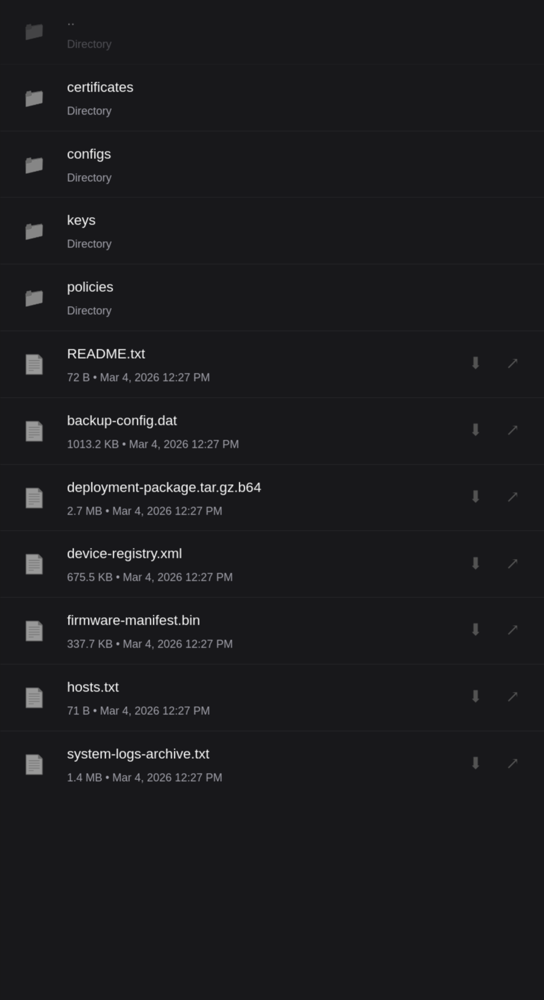

# Static

A lightweight static file server for hosting intranet resources and configurations.

Static provides a simple, efficient way to serve files across your internal network. Ideal for distributing public keys, certificates, configuration files, and other non-sensitive resources to systems within your infrastructure.

**Preview #1**

## Configuration

The server is configured through environment variables in `.env`:

- `STATIC_PORT` - Port to expose (default: 3232)
- `STATIC_CONTAINER_NAME` - Container name (default: static)
- `STATIC_HOSTNAME` - Container hostname (default: static)
- `STATIC_VOLUMES_PUBLIC` - Path to public files (default: ./public)

Place your files in the `public/` directory. The server will automatically generate directory listings and serve files with appropriate MIME types.

## Installation

Run `make start` to build and launch the container with Docker Compose.

The Makefile provides commands for managing the application:
- `make logs` to view output
- `make restart` to reload
- `make stop` to shut down
- `make shell` to access the container
- `make upgrade` to force recreate containers

If you prefer running directly on your system, ensure you have PHP 8.2+ and Apache installed, then point your web server to the `public/` directory.

## Development

The project includes a devcontainer configuration for a consistent development environment. Open the repository in VS Code or any devcontainer-compatible editor.

To get started, use `make develop` to start a PHP development server on port 8000. This is useful for rapid iteration on the interface and testing file serving.

## Usage

Access the server at `http://localhost:3232`.

## License

GPL-3.0
